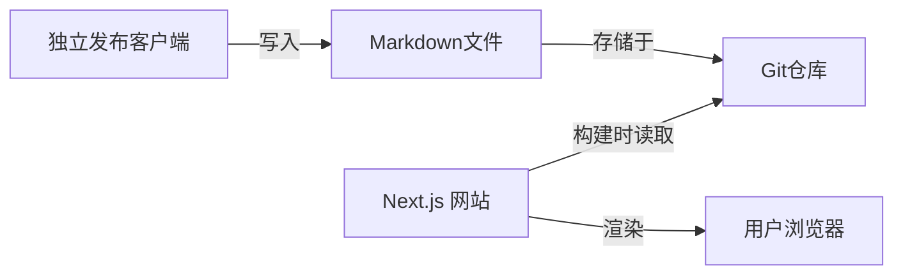

以下是根据你的需求整理而成的 **个人网站需求规格说明书 (Shelter Café)**，采用结构化文档格式，便于后续开发和参考：

---

# Shelter Café 个人网站需求规格说明书
**版本**：1.0
**作者**：夏
**最后更新**：2025年6月23日

---

## 一、项目概述
### 1.1 项目背景
作为前端开发者，夏希望构建一个以 **咖啡馆主题** 为核心的个人网站，命名为 **Shelter Café**，传达轻松、舒适、创意的氛围。网站需整合技术笔记、作品集（未来扩展）和个人随笔三类内容，并支持深色模式、响应式布局与高性能访问。

### 1.2 核心目标
- 🎯 展示个人技术能力与创作内容
- ☕ 通过视觉与交互传递“避风港”体验
- ⚡ 技术实践：SSR、组件化、现代化前端栈

---

## 二、核心需求
### 2.1 内容类型与结构
| **内容类型** | **页面路径**      | **设计特点**                     | **状态**   |
|--------------|-------------------|----------------------------------|------------|
| 技术笔记     | `/articles`       | 极简单栏列表+无限滚动            | 核心功能   |
| 技术笔记详情 | `/articles/[slug]`| Markdown渲染+代码高亮+目录导航   | 核心功能   |
| 个人随笔     | `/thoughts`       | 微博式流布局（无详情页）         | 核心功能   |
| 主页         | `/`               | 视觉焦点+动态效果+个人简介       | 核心功能   |
| 关于页       | `/about`          | 个人信息+社交媒体链接            | 核心功能   |
| 作品集       | `/works`          | 网格卡片布局                     | **暂缓开发** |

### 2.2 关键功能需求
#### （1）内容展示与交互
| **功能**          | **要求**                                                                 | **优先级** |
|-------------------|--------------------------------------------------------------------------|------------|
| 文章无限滚动      | 按时间倒序加载，支持 `Articles` & `Thoughts` 列表页                      | 高         |
| 全局搜索          | `Cmd+K`/`Ctrl+K` 触发，支持标题/内容检索（客户端搜索方案）               | 高         |
| 文章详情工具      | 代码高亮（Prism.js）、目录导航、上一篇/下一篇跳转                        | 高         |
| 点赞功能          | 无用户系统，基于 **LocalStorage + IP限制** 防刷（24h内单IP限1次）       | 中         |
| 响应式导航        | 桌面端：顶部导航栏；移动端：底部固定导航栏                               | 高         |

#### （2）主题与样式
| **模块**          | **规范**                                                                 |
|-------------------|--------------------------------------------------------------------------|
| **设计理念**      | 咖啡馆主题（温暖/自然/慢节奏）                                          |
| **配色方案**      | 主色：棕黄 (`#D2B48C`)、奶油白 (`#FFF8E7`)；深色模式：深棕 (`#5D4037`)  |
| **字体**          | 中文衬线体：思源宋体/霞鹜文楷；无衬线体：思源黑体                       |
| **动效原则**      | 微交互为主（悬停反馈、平滑滚动），避免过度动效影响性能                  |

---

## 三、技术方案
### 3.1 技术栈
| **类别**       | **技术选型**                              | **用途**                     |
|----------------|-------------------------------------------|------------------------------|
| 核心框架       | Next.js 14 (App Router)                   | SSR/SSG支持 + 路由管理       |
| 样式引擎       | Tailwind CSS + 自定义主题                 | 原子化样式 + 深色模式        |
| UI组件库       | shadcn/ui (基于 Radix UI)                 | 可访问性组件 + 主题集成      |
| 部署平台       | Vercel                                    | 自动优化 + Serverless Functions |

### 3.2 内容管理架构


### 3.3 关键模块实现
| **模块**          | **技术方案**                                                                 |
|-------------------|-----------------------------------------------------------------------------|
| 深色模式          | `next-themes` + `localStorage` 持久化 + Tailwind `dark:` 前缀               |
| 搜索功能          | **Lunr.js**（构建时生成索引，客户端搜索）                                    |
| 点赞计数          | Vercel KV (Redis) 存储 + API Route 校验 IP                                   |
| 图片优化          | Next.js `next/image` 组件（自动 WebP/AVIF 转换 + Lazy Loading）              |
| 无限滚动          | `react-intersection-observer` 监听 + 分页加载                                |

---

## 四、UI/UX 详细规范
### 4.1 页面布局规范
| **页面**        | **布局要求**                                                                 |
|-----------------|-----------------------------------------------------------------------------|
| 主页 (`/`)      | 全屏视觉区域（背景图/视频）+ 居中个人信息卡片 + 动效导航入口                |
| 文章列表 (`/articles`) | 单栏列表（标题+摘要+日期），支持无限滚动                                  |
| 随笔流 (`/thoughts`)   | 单栏卡片流（每条完整展示），卡片样式参考“咖啡杯垫”设计                      |
| 文章详情        | 左侧内容区（Markdown渲染），右侧浮动目录导航（>768px屏显示）                |

### 4.2 响应式断点
| **设备**        | **断点**    | **导航栏位置**   |
|-----------------|-------------|------------------|
| 桌面端          | >768px      | 顶部             |
| 移动端          | ≤768px      | 底部固定         |

### 4.3 动效清单
| **场景**                | **效果描述**                                                                 |
|-------------------------|-----------------------------------------------------------------------------|
| 页面切换                | 淡入淡出（`framer-motion`）                                                 |
| 按钮悬停                | 轻微缩放（`scale-105`） + 阴影加深                                           |
| 图片加载                | 透明度渐变（`opacity-0 → opacity-100`）                                      |
| 无限滚动加载            | 底部加载指示器旋转动画                                                      |

---

## 五、非功能性需求
| **类别**       | **要求**                                                                     |
|----------------|-----------------------------------------------------------------------------|
| 性能           | Lighthouse 评分 ≥90（SSR/SSG + 图片懒加载 + 代码分割）                      |
| SEO            | 自动生成 sitemap.xml，语义化 HTML 标签，OpenGraph 协议支持                   |
| 可访问性       | WCAG 2.1 AA 标准（通过 `shadcn/ui` 组件 + 手动 ARIA 补充）                   |
| 浏览器兼容性   | 现代浏览器（Chrome, Firefox, Safari, Edge 最新版）+ 移动端 iOS/Android      |
| 维护性         | 组件化结构（`/components` 目录），TypeScript 类型约束                        |

---

## 六、开发里程碑（MVP 版本）
### Phase 1：基础框架搭建
- [ ] 初始化 Next.js + Tailwind + shadcn 项目
- [ ] 实现深色模式切换与持久化
- [ ] 构建响应式导航组件（桌面/移动双方案）

### Phase 2：内容管道与核心页面
- [ ] Markdown 解析系统（`remark` + `rehype-highlight`）
- [ ] 文章详情页渲染（目录导航/代码高亮）
- [ ] 文章列表页无限滚动实现
- [ ] 随笔流页面完整展示逻辑

### Phase 3：高级功能
- [ ] 全局搜索（`Lunr.js` 集成）
- [ ] 点赞功能（API Route + Vercel KV）
- [ ] 主页视觉动效开发（`framer-motion`）

### Phase 4：优化与发布
- [ ] 性能调优（Lighthouse 审计）
- [ ] 自动化部署（Vercel + GitHub CI）
- [ ] 基础 SEO 配置（sitemap/robots.txt）

---

## 附录
### A1. 主题色值
```json
{
  "light": {
    "primary": "#D2B48C",
    "background": "#FFF8E7",
    "text": "#3E2723"
  },
  "dark": {
    "primary": "#5D4037",
    "background": "#121212",
    "text": "#EEEEEE"
  }
}
```

### A2. 字体栈
```css
:root {
  --font-serif: "Source Han Serif SC", "LXGW WenKai", serif;
  --font-sans: "Source Han Sans SC", "Noto Sans SC", sans-serif;
}
```

### A3. 依赖库清单
```markdown
- next@14.x
- react@18.x
- tailwindcss@3.x
- shadcn/ui (基于 radix-ui)
- next-themes
- remark/rehype 生态
- lunr.js
- vercel/kv
```